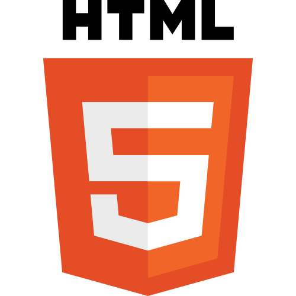
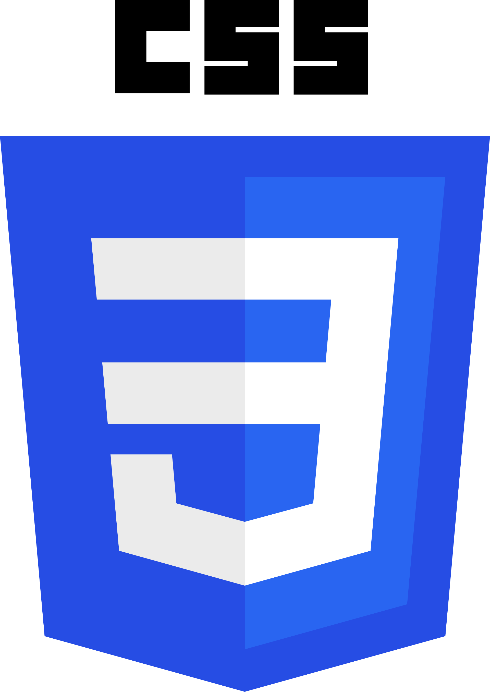
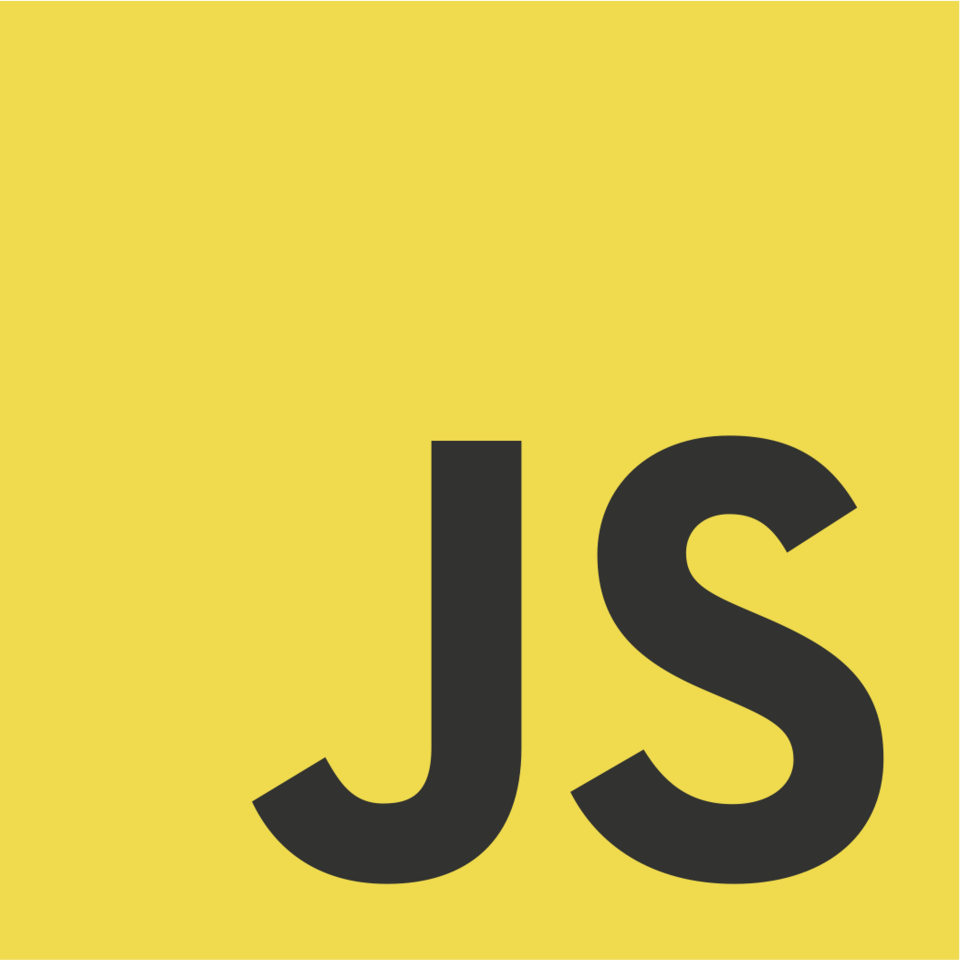
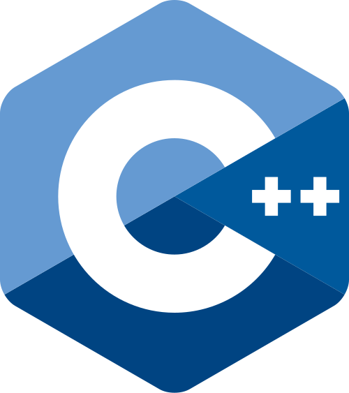
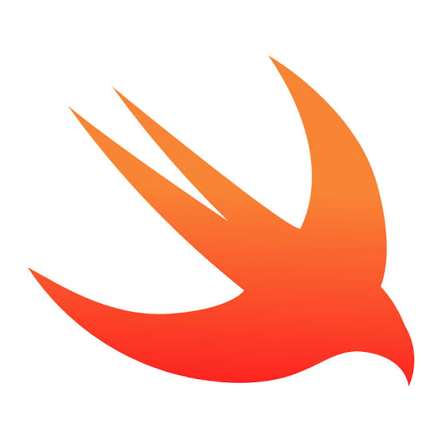

# Hey there, I'm Paul 👋

**Young software engineer with a passion for building things.**

---

### About Me

I started programming at the age of **12** — back then just HTML, CSS, and JavaScript. Since then I've kept expanding my toolkit, and today I work with:

  &nbsp;
  &nbsp;
  &nbsp;
  &nbsp;
  &nbsp;
  

I also enjoy working with **Arduino Uno** — both using and programming it for small hardware projects. 

---

### How I Work

I have **ADHD**, which means I often work on multiple projects in parallel — jumping between them depending on what excites me most at the moment. It's not always linear, but it keeps things creative and fun! 

---

### Let's Connect

Feel free to reach out or check out my projects below — not everything is public, but it's worth a look! 
